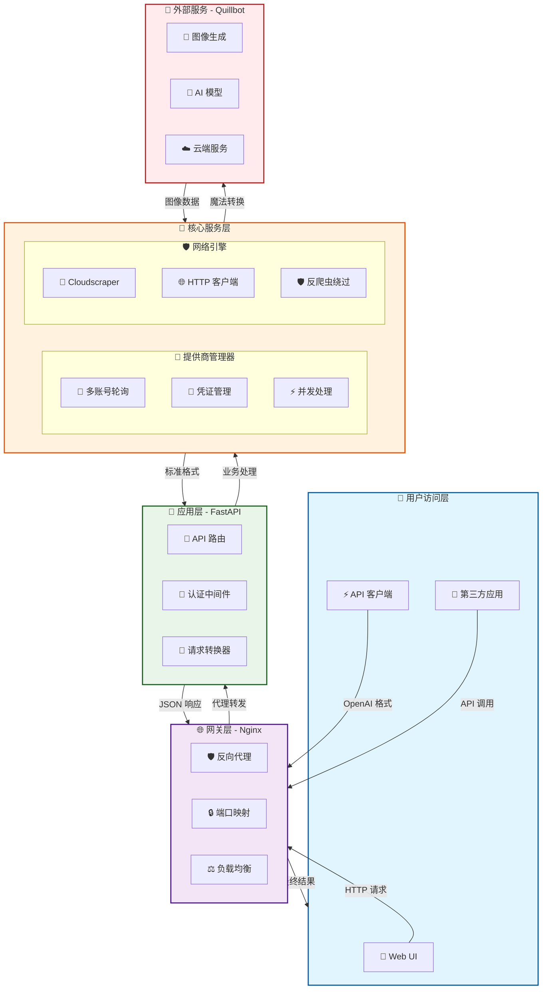

# ✒️ Quillbot-2API：你的私人 AI 图像魔法师 🎨


> "任何足够先进的科技，都与魔法无异。" —— 亚瑟·克拉克

欢迎来到 `quillbot-2api` 的世界！在这里，我们不只是在编写代码，我们是在**驯服数字巨龙**，将强大的 Quillbot AI 图像生成能力转化为你可以随心所欲调遣的魔法。这个项目是一个桥梁，一扇任意门，让你能够用最熟悉、最标准的方式（OpenAI API 格式）释放无尽的创造力。

我们相信，技术的真正价值在于**赋能**。它应该像空气和水一样，轻松、自然地融入你的工作流，而不是成为一座需要费力攀登的高山。这个项目的诞生，正是源于这样一个简单而纯粹的信念：**让强大的工具变得平易近人，让每个人都能成为自己想象世界里的造物主。** 🚀

---

## 📜 项目核心思想：化繁为简，万法归一

想象一下，你有一个非常厉害的魔法师朋友（Quillbot），他能画出任何你想要的东西，但你每次都得用一套非常复杂的咒语和手势才能让他动手。是不是很累？

`quillbot-2api` 所做的，就是为你和这位魔法师之间安排了一位**"同声传译"**。你只需要用全世界最通用的"普通话"（OpenAI API 格式）下达指令，这位翻译官就会立刻将其转换成魔法师能听懂的古老咒语。

- **专业术语解释**：我们实现了一个**代理服务**，它接收遵循 OpenAI `v1/images/generations` 和 `v1/chat/completions` API 规范的 HTTP 请求，然后将其"翻译"成 Quillbot 网站能够理解的请求格式，再将 Quillbot 返回的结果"翻译"回 OpenAI 的标准格式返回给你。

- **大白话**：你假装在和 OpenAI 对话，但实际上是 `quillbot-2api` 在背后帮你使唤 Quillbot 去干活，而且还把结果工工整整地摆在你面前。是不是很酷？😎

---

## 🏗️ 项目架构全景图



### 🎯 架构核心组件说明

| 层级 | 组件 | 图标 | 职责 | 关键技术 |
|-----|------|------|------|----------|
| **用户层** | Web UI / API 客户端 | 📱 ⚡ | 提供用户交互界面和 API 接入点 | HTML5, JavaScript, Fetch API |
| **网关层** | Nginx 反向代理 | 🌐 🛡️ | 请求转发、负载均衡、安全防护 | Nginx, IP Hash, SSL/TLS |
| **应用层** | FastAPI 服务 | 🚀 🎯 | API 路由、认证、请求响应处理 | FastAPI, Uvicorn, Pydantic |
| **核心层** | 提供商管理器 | 🔧 🔄 | 多账号轮询、并发控制、错误处理 | Threading, Asyncio, Round-robin |
| **网络层** | Cloudscraper 引擎 | 🛡️ 🚀 | 绕过 Cloudflare 防护、模拟浏览器 | Cloudscraper, Node.js |
| **外部服务** | Quillbot AI | 🌈 🎨 | 实际的图像生成和 AI 处理 | REST API, WebSocket |

---

## 📁 项目文件结构

```
📂 quillbot-2api/
├── 📄 .env                    # 🔐 环境配置文件（生产环境）
├── 📄 .env.example            # 📋 环境配置模板
├── 📄 Dockerfile              # 🐳 容器构建配置
├── 📄 docker-compose.yml      # 🚀 容器编排配置
├── 📄 main.py                 # 🎯 FastAPI 应用入口
├── 📄 nginx.conf              # 🌐 Nginx 反向代理配置
├── 📄 requirements.txt        # 📦 Python 依赖列表
├── 📂 app/                    # 💼 应用核心代码
│   ├── 📂 core/               # 🎪 核心功能模块
│   │   ├── 📄 __init__.py
│   │   └── 📄 config.py       # ⚙️ 配置管理系统
│   ├── 📂 providers/          # 🔌 服务提供商模块
│   │   ├── 📄 __init__.py
│   │   ├── 📄 base_provider.py # 📐 提供商抽象基类
│   │   └── 📄 quillbot_provider.py # 🎨 Quillbot 核心实现
│   └── 📂 utils/              # 🛠️ 工具函数库
│       └── 📄 sse_utils.py    # 📡 服务器推送工具
└── 📂 static/                 # 🎨 前端静态资源
    ├── 📄 index.html          # 🏠 主页面
    ├── 📄 script.js           # ⚡ 前端交互逻辑
    └── 📄 style.css           # 🎭 样式设计
```

---

## ✨ 核心特色功能

### 🎭 完美 API 兼容性
- **无缝集成**: 100% 兼容 OpenAI API 格式，可直接替换现有 OpenAI 客户端
- **标准规范**: 支持 `v1/images/generations` 和 `v1/chat/completions` 端点
- **广泛兼容**: 支持所有基于 OpenAI SDK 的应用和框架

### 🔧 智能多账号管理
```python
# 🎯 多账号轮询算法示例
class QuillbotProvider:
    def __init__(self):
        self.accounts = self._load_accounts()  # 🔄 动态加载账号
        self.current_index = 0                 # 📍 当前账号索引
        self.lock = threading.Lock()          # 🔒 线程安全锁
    
    def _get_next_account(self):
        with self.lock:
            account = self.accounts[self.current_index]
            self.current_index = (self.current_index + 1) % len(self.accounts)
            return account  # ⚡ 自动切换到下一个账号
```

### 🛡️ 高级反爬虫防护
- **智能绕过**: 使用 `cloudscraper` 自动处理 Cloudflare 挑战
- **浏览器模拟**: 模拟真实浏览器行为，避免被检测为机器人
- **自动重试**: 智能重试机制，提高请求成功率

### 🚀 一键容器化部署
```yaml
# 🐳 Docker Compose 配置示例
version: '3.8'
services:
  app:
    build: .
    ports:
      - "8000:8000"
    environment:
      - API_MASTER_KEY=${API_MASTER_KEY}
  nginx:
    image: nginx:alpine
    ports:
      - "${NGINX_PORT}:80"
    depends_on:
      - app
```

---

## 🚀 快速开始指南

### 📋 前置要求
- 🐳 Docker & Docker Compose
- 🔑 Quillbot 高级账户
- 🌐 网络连接

### 🛠️ 三步部署流程

#### 步骤 1: 获取项目代码
```bash
git clone https://github.com/lzA6/quillbot-2api.git
cd quillbot-2api
```

#### 步骤 2: 配置认证信息

**获取 Quillbot 凭证：**
1. 🔍 使用 Chrome 浏览器登录 `https://quillbot.com/`
2. 🛠️ 按 `F12` 打开开发者工具
3. 📡 切换到"网络"(Network) 面板
4. 🎨 进行一次图像生成操作
5. 📋 复制 `cookie` 和 `useridtoken` 值

**配置环境变量：**
```bash
cp .env.example .env
# 编辑 .env 文件，填入你的凭证
```

示例 `.env` 配置：
```env
# 🔐 API 主密钥
API_MASTER_KEY=your_super_secure_key_here

# 🌐 服务端口
NGINX_PORT=8088

# 🔑 Quillbot 账户配置（支持多个账户）
QUILLBOT_AUTH_1='{"cookie": "your_cookie_here", "token": "your_token_here"}'
QUILLBOT_AUTH_2='{"cookie": "cookie_2", "token": "token_2"}'
```

#### 步骤 3: 启动服务
```bash
docker-compose up -d
```

🎉 **恭喜！** 服务现在运行在 `http://localhost:8088`

---

## 🔬 技术深度解析

### 🏗️ 系统架构详解

#### 第一层：网关层 (Nginx)
```nginx
# 🛡️ Nginx 配置核心逻辑
upstream app_server {
    ip_hash;  # 🔗 会话保持
    server app:8000;
}

server {
    listen 80;
    
    location / {
        proxy_pass http://app_server;  # 🔄 请求转发
        proxy_set_header Host $host;
    }
}
```
- **职责**: 请求路由、负载均衡、SSL 终止
- **优势**: 高性能、高并发、安全可靠

#### 第二层：应用层 (FastAPI)
```python
# 🚀 FastAPI 核心路由
@app.post("/v1/images/generations")
async def create_image(request: ImageRequest, 
                      api_key: str = Depends(verify_api_key)):
    """
    🎨 图像生成端点
    """
    provider = QuillbotProvider()
    images = await provider.generate_images(request)
    return StandardResponse(data=images)
```
- **特性**: 异步处理、自动文档、类型安全
- **性能**: 高吞吐量、低延迟

#### 第三层：核心服务层
```python
# 💎 核心图像生成逻辑
class QuillbotProvider:
    async def generate_images(self, request: ImageRequest) -> List[str]:
        """生成多张图像的智能方法"""
        # 🔄 多账号轮询
        account = self._get_next_account()
        
        # ⚡ 并发请求处理
        tasks = []
        for _ in range((request.n + 1) // 2):
            task = self._single_generation(account, request)
            tasks.append(task)
        
        # 🎯 并行执行
        results = await asyncio.gather(*tasks)
        return [img for batch in results for img in batch]
```

### 🛡️ 关键技术突破

#### Cloudflare 绕过机制
```python
# 🚀 高级反爬虫实现
def create_scraper_session():
    """创建能够绕过 Cloudflare 的会话"""
    return cloudscraper.create_scraper(
        browser={
            'browser': 'chrome',
            'platform': 'windows',
            'desktop': True
        }
    )
```

#### 智能错误处理
```python
# 🔧 健壮的错误处理系统
class QuillbotErrorHandler:
    @staticmethod
    async def handle_generation_error(error: Exception) -> Dict:
        """智能错误分类和处理"""
        error_mapping = {
            "rate_limit": "请稍后重试",
            "invalid_prompt": "提示词包含违禁内容",
            "network_error": "网络连接异常"
        }
        # 🎯 智能错误识别和用户友好提示
```

---

## 🎯 使用方式

### 1. 🖥️ Web 界面使用
访问 `http://localhost:8088` 使用内置的 Web UI：

```html
<!-- 🎨 图像生成界面示例 -->
<div class="generation-panel">
    <input type="text" id="prompt" placeholder="请输入提示词...">
    <select id="model">
        <option value="realistic">真实风格</option>
        <option value="artistic">艺术风格</option>
    </select>
    <button onclick="generateImage()">🎨 生成图像</button>
</div>
```

### 2. 🔌 API 调用方式
```python
import openai

# ⚙️ 配置客户端
client = openai.OpenAI(
    api_key="your_api_master_key",
    base_url="http://localhost:8088/v1"
)

# 🎨 生成图像
response = client.images.generate(
    model="quillbot-image",
    prompt="一只在太空站喝咖啡的猫咪",
    n=2,
    size="1024x1024"
)

# 📸 显示结果
for image in response.data:
    print(f"图像 URL: {image.url}")
```

### 3. 🛠️ 直接 HTTP 请求
```bash
curl -X POST "http://localhost:8088/v1/images/generations" \
  -H "Authorization: Bearer your_api_master_key" \
  -H "Content-Type: application/json" \
  -d '{
    "model": "quillbot-image",
    "prompt": "夕阳下的古城堡",
    "n": 1,
    "size": "1024x1024"
  }'
```

---

## 📊 性能优化策略

### ⚡ 并发处理优化
```python
# 🚀 智能并发控制
class ConcurrentManager:
    def __init__(self, max_concurrent: int = 3):
        self.semaphore = asyncio.Semaphore(max_concurrent)
    
    async def bounded_gather(self, tasks):
        """受限的并发执行"""
        async with self.semaphore:
            return await asyncio.gather(*tasks)
```

### 🔄 连接池管理
```python
# 🌐 高效的连接复用
class ConnectionPool:
    def __init__(self):
        self.session = aiohttp.ClientSession(
            connector=aiohttp.TCPConnector(
                limit=100,  # 🎯 最大连接数
                limit_per_host=30  # 🎯 每主机连接数
            )
        )
```

---

## 🛡️ 安全特性

### 🔐 API 认证机制
```python
# 🛡️ 安全的 API 密钥验证
async def verify_api_key(api_key: str = Header(...)):
    """验证 API 密钥的依赖函数"""
    if not secrets.compare_digest(api_key, settings.API_MASTER_KEY):
        raise HTTPException(status_code=401, detail="无效的 API 密钥")
    return api_key
```

### 📝 请求验证
```python
# ✅ 输入数据验证
class ImageRequest(BaseModel):
    prompt: str = Field(..., min_length=1, max_length=1000)
    model: str = Field(default="quillbot-image")
    n: int = Field(default=1, ge=1, le=4)
    size: str = Field(default="1024x1024")
    
    @validator('prompt')
    def validate_prompt(cls, v):
        """提示词内容验证"""
        if contains_sensitive_content(v):
            raise ValueError("提示词包含敏感内容")
        return v
```

---

## 🔮 未来发展规划

### 🎯 短期目标 (v1.1 - v1.3)
- [ ] **凭证自动续期** 🔄
- [ ] **更精细的错误处理** 🎯
- [ ] **流式聊天支持** 📡
- [ ] **动态模型发现** 🔍

### 🚀 中期规划 (v2.0)
- [ ] **插件化架构** 🔌
- [ ] **多提供商支持** 🌈
- [ ] **用户管理系统** 👥
- [ ] **使用量统计** 📊

### 🌟 长期愿景
- [ ] **分布式部署** 🌐
- [ ] **机器学习优化** 🤖
- [ ] **生态系统建设** 🏗️

---

## 💡 应用场景

### 🎨 内容创作
- **博客配图**: 自动为文章生成相关图片
- **社交媒体**: 快速创建吸引人的视觉内容
- **营销材料**: 生成产品宣传图片

### 🔧 开发集成
- **应用集成**: 为应用程序添加 AI 图像生成功能
- **自动化流程**: 批量生成图片用于数据增强
- **原型设计**: 快速创建 UI/UX 原型图

### 🎓 教育研究
- **教学工具**: 可视化复杂概念
- **学术研究**: 生成实验数据可视化
- **创意学习**: 激发学生创造力

---

## 🤝 贡献指南

我们欢迎所有形式的贡献！🎉

### 🐛 报告问题
发现 Bug？请通过 [GitHub Issues](https://github.com/lzA6/quillbot-2api/issues) 报告。

### 💡 功能建议
有新想法？欢迎提交 Feature Request！

### 🔧 代码贡献
1. 🍴 Fork 项目
2. 🌿 创建特性分支
3. 💻 提交更改
4. 📤 推送分支
5. 🎯 创建 Pull Request

### 📚 文档改进
即使是文档的改进也同样重要！

---


## 🙏 致谢

感谢所有为这个项目做出贡献的开发者们！🌟

特别感谢：
- **Quillbot** 团队提供强大的 AI 图像生成能力
- **FastAPI** 社区提供的优秀 Web 框架
- **Docker** 团队提供的容器化解决方案
- 所有**开源项目**的贡献者

---

## 🔗 有用链接

- 📖 [完整文档](https://github.com/lzA6/quillbot-2api/docs)
- 🐛 [问题追踪](https://github.com/lzA6/quillbot-2api/issues)
- 💬 [讨论区](https://github.com/lzA6/quillbot-2api/discussions)
- 📦 [Docker Hub](https://hub.docker.com/r/yourname/quillbot-2api)

---

**让我们一起构建更好的 AI 开发生态！** 🚀

如果有任何问题或建议，请随时联系我们。祝使用愉快！🎨✨
